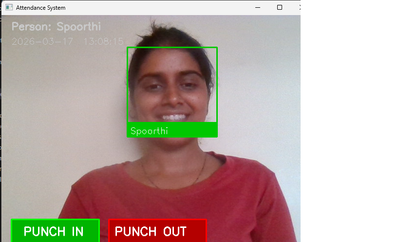
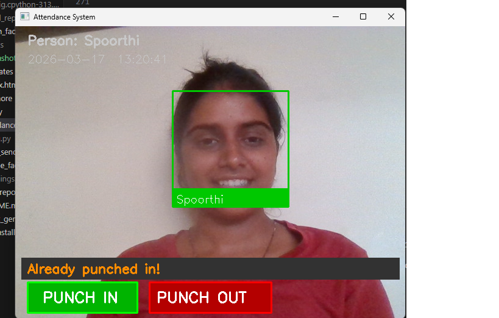
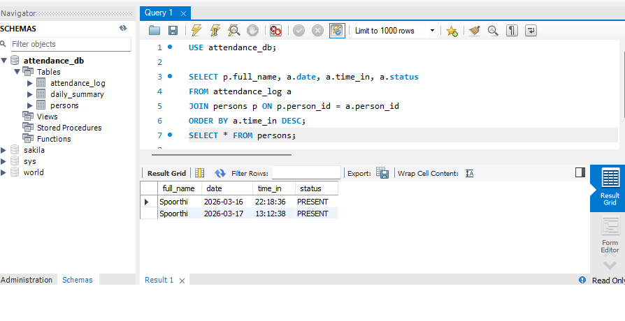

# Face Recognition Attendance System

AI-powered contactless attendance system using Face Recognition, Python, DeepFace, MySQL and Flask.

## Project Demo





## Features
- Real-time face recognition using DeepFace and OpenCV
- Punch In / Punch Out with live webcam
- Green box on known faces, Red box on unknown faces
- MySQL database stores all attendance records
- Beautiful color coded Excel attendance reports
- Flask web dashboard with charts and filters
- Search and filter attendance by name or status
- Weekly attendance trend chart

## Tech Stack
| Technology | Purpose |
|---|---|
| Python 3.13 | Core programming language |
| DeepFace | Face recognition AI |
| OpenCV | Webcam and video processing |
| MySQL | Attendance database |
| Flask | Web dashboard |
| pandas | Data processing |
| openpyxl | Excel report generation |

## Project Structure
```
Face-Recognition-Attendance-System/
├── known_faces/          # Student/employee photos
├── screenshots/          # Project screenshots
├── templates/
│   └── index.html        # Flask dashboard HTML
├── attendance.py         # Live webcam + Punch In/Out
├── encode_faces.py       # Register known faces
├── excel_report.py       # Generate Excel reports
├── report_generator.py   # Basic report generator
├── app.py                # Flask web dashboard
├── config.py             # Database settings
└── README.md
```

## Setup Instructions

### Step 1 — Install dependencies
```
pip install deepface opencv-python pandas openpyxl flask mysql-connector-python
```

### Step 2 — Configure database
Edit `config.py` with your MySQL credentials:
```python
DB_CONFIG = {
    "host"     : "localhost",
    "database" : "attendance_db",
    "user"     : "root",
    "password" : "your_password",
    "port"     : 3306
}
```

### Step 3 — Setup MySQL database
Run these SQL scripts in MySQL Workbench:
```sql
CREATE DATABASE attendance_db;
USE attendance_db;

CREATE TABLE persons (
    person_id  INT AUTO_INCREMENT PRIMARY KEY,
    full_name  VARCHAR(100) NOT NULL UNIQUE,
    department VARCHAR(50),
    email      VARCHAR(150),
    created_on DATE DEFAULT (CURRENT_DATE)
);

CREATE TABLE attendance_log (
    log_id     INT AUTO_INCREMENT PRIMARY KEY,
    person_id  INT,
    date       DATE DEFAULT (CURRENT_DATE),
    time_in    TIME DEFAULT (CURRENT_TIME),
    time_out   TIME NULL,
    status     VARCHAR(10) DEFAULT 'PRESENT',
    punch_type VARCHAR(10) DEFAULT 'IN',
    FOREIGN KEY (person_id) REFERENCES persons(person_id),
    UNIQUE KEY unique_attendance (person_id, date)
);
```

### Step 4 — Add face photos
Add clear front-facing photos to `known_faces/` folder:
```
known_faces/
├── john_doe.jpg
├── jane_smith.jpg
└── spoorthi.jpeg
```

### Step 5 — Register faces
```
python encode_faces.py
```

### Step 6 — Start attendance system
```
python attendance.py
```

### Step 7 — Start web dashboard
```
python app.py
```
Open browser: `http://127.0.0.1:5000`

### Step 8 — Generate Excel report
```
python excel_report.py
```

## How It Works
1. Camera captures live video feed
2. DeepFace detects and recognizes faces
3. Matched face shown with green box and name
4. Employee clicks Punch In or Punch Out button
5. Attendance saved to MySQL database instantly
6. Excel report generated with present/absent list
7. Flask dashboard shows live attendance stats

## Database Schema
- `persons` — Stores registered employees
- `attendance_log` — Stores all punch in/out records
- `daily_summary` — Stores daily attendance counts

## Developer
**Spoorthi** — Engineering Student

GitHub: [Spoorthi12-web](https://github.com/Spoorthi12-web)
